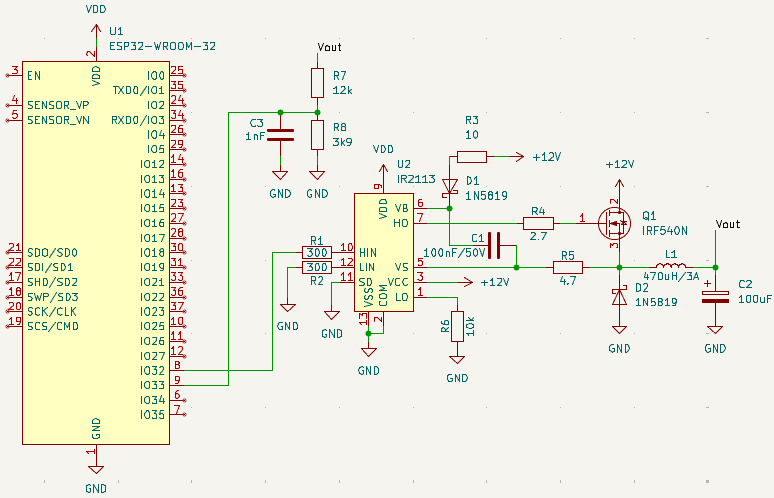

# Práticas e Projeto Final
## Introdução
O projeto final consiste no controle remoto (Iot) de um conversor buck, usando o ESP32-DevKitC com PWM fixo em 50kHz e a utilização do protocolo MQTT usando o MyQttHub Cloud Server. O código do projeto final está na pasta FinalPCTulio.

Observação: O chip IR2113 possuí varias versões PDIP, verifique a pinagem antes de conectar.

---
## Especificações:
- Entrada 12V/3A
- Saída 0~10,6V/2A
- PWM 50kHz
- Eficiência de 80%
- Indutor 470uH/3A Ferrite
- Cout 100uF/16V
---
## Esquematico usando ESP32-DevKitC:

---
## Cálculo do Controlador: 
A função típica de um conversor buck é dada por: 
$$G(s) = \frac{V_o(s)}{d(s)} = \frac{V_{in_{CC}}}{LC \cdot \left(s^2 + s \cdot \frac{1}{RC} + \frac{1}{LC}\right)}$$
 Para o projeto obtemos a seguinte expressão(R=12V/2A=6): 
$$G(s) = \frac{180.0}{2.82 \cdot 10^{-7} s^2 + 0.00047s + 6.0}$$
 Usando o sintonizador PID do MATLAB temos o seguinte controlador:
$$C(s) = \frac{124,1}{s}$$
Apesar de ser um controlador puramente integrativo, foi o melhor controlador obtido visando ter a resposta mais rápida  possível (tempo de acomodação) com overshoot de 10% e ação do controlador de no máximo 90% do duty cycle no transitório inicial.

Usando a aproximação de tustin para discretizar, obtemos a seguinte equação diferenças que foi aplicado no código: 
$$y[n] = 0,001241 \cdot x[n] + 0,001241 \cdot x[n-1] + y[n-1]$$
 Nesse caso x[n] é o nosso erro obtido (setpoint-vout) e y[n] o duty cycle a ser alterado, variando a saída que é dada por: 
$$V_{out} = V_{in} \cdot D$$
 Isso para região Linear. Um outro fato é que a tensão está sendo lida por um divisor de tensão, razão pela qual é preciso no código multiplicar por 4,92 a tensão de modo a ter uma realimentação unitária. Ademais o circuito funciona usando um capacitor de bootstrap acoplado ao IR2113.

---
## Resultados

O controle funcionou usando o mqtt e foi possível chegar em potências de até 15W sem ripple considerável.